# ToDoList Landing Page
ToDoList - the To-Do list application built around speed.

## Overview

1. Description
2. Team
3. Greatly Expanded User Documentation
    - 3.1 General Commands & Launch 
    - 3.2 Basic Task Management
    - 3.3 Filtering
    - 3.4 Sorting
    - 3.5 Tags
    - 3.6 Edit Mode
    - 3.7 Further Documentation on Dates & Notifications
    - 3.8 Extra - Tips
4. Visuals (Application Screenshots)
    - 4.1 Login Page
    - 4.2 Register Page
    - 4.3 View Mode
    - 4.4 Tag List
    - 4.5 Create Tag 
    - 4.6 Delete Tag
    - 4.7 Filter By Tag
    - 4.8 Edit View
    - 4.9 Filtering & Sorting
    - 4.10 Notifications
5. Installation
6. Acknowledgments of Third Parties
7. License

## 1. Description
The main idea of ToDoList, our To-Do list application, is to optimize the time a user will have to spend inputting tasks so
they can spend more of their time doing the task themselves. Developed with inspiration from Vim/Vi, there are 
shortcuts for everything you could possibly need built into the application. There is no need, and no ability, to use
your mouse/cursor in our application. ToDoList also supports online and offline synching to allow you to write your tasks on the 
go and access them from any device as long as you remember your username and password.

## 2. Team

We are **Team 210**. 

Members:
- Adeit Dalal 
- Javin Mehta
- Rahul Gudise
- Rishabh Sambare

## 3. User Documentation
Note: This application creates a background process when closed. To fully exit the application on Windows and MacOS, you 
will have to exit from the system tray.

All following shortcuts are also stored in a document keybindings.pdf at the top level directory for easier access.

See the images in Section 4 for images on how each feature being explained looks like! Specific image references 
are provided in the documentation.

### 3.1 General Commands & Launch
Pressing **escape** while inside of a textbox will remove focus from the textbox and allow you to input hotkeyed commands. 

When launching the application, you will reach the login screen (_Image 4.1_). If this is your first time using the application, 
you will need to create an account (you will need wifi for this step). From the login screen, press **R** to get to the register 
screen (_Image 4.2_). To return to the log in screen, press **L**. From either page, pressing **U** will set focus on the username 
field where you can enter your username, and pressing **P** will allow you to enter your desired password (or press **tab** to toggle 
through textboxes). Press **enter** to login/register.

After registering or logging in, you will reach the main screen (See _Image 4.3_ - this is an established account). A new account will 
have no tasks in their To Do list by default.

This is called the View Mode! Here you can perform a variety of functions on your To-Do List.

- Unsure of what key you just pressed? Press **escape** to reset the command you were just inputting.
- Change Account Username (**u**) (Needs wifi)
- Change Account password (**p**) (Needs wifi)
- Undo Previous Command (**z**)
- Redo Previous Command (**y**)

### 3.2 Basic Task Management
These are the basic functionalities for managing tasks in ToDoList.

- Add a blank task (**a**)
- Edit highlighted task (**e**)
- Cycle through tasks
    - Cycle Highlight Downwards (**j**)
    - Cycle Highlight Upwards (**k**)
- Delete a task (**d**)
- Toggle a task to be completed (**q**)
- Delete all completed tasks from the current view (**b**)
- Shift a task up in list (**shift + up arrow**)
- Shift a task down in list (**shift + down arrow**)
- Cut Task (**x**)
- Copy Task (**c**)
- Paste Task (**v**)
- Duplicate task (**m**)

### 3.3 Filtering
Filtering will only show tasks that meet the requirements specified in the filter box once the command is run.

- Filter by Name (**f + n**)
- Filter by Date (**f + d**)
- Filter by Priority (**f + p**)
- Filter by Tag (**f + t**)
- Filter by Value (Search function) (**f + v**)
- Clear filters (**f + c**)
- **enter** to apply specified filter
- See _Image 4.7_ for a visual of the filtering UI
- See _Image 4.9_ for an example of how filtered tasks look like

### 3.4 Sorting
By default, sort is done by ascending. You can sort by descending by pressing (**shift**) when inputting a command. 

- Sort by Name (**s + n**)
- Sort by Priority (**s + p**)
- Sort by Date (**s + d**)
- Clear Sort function (**s + c**)
- For example, to sort by name descending is **shift + s + n**
- See _Image 4.9_ for an example of how sorted tasks look like

### 3.5 Tags
Tags are a way to add customized groups to tasks that can be filtered and searched for. 

- Create a tag (**t + c**)
- Delete a tag (**t + d**) (autocomplete with **tab**)
- View Tag list (all tags) (**t + l**)
- **enter** to create/delete specified tag. 
- See _Images 4.4, 4.5, 4.6_ to see visuals of the tag commands

### 3.6 Edit Mode
While editing a task, you'll be entered into edit mode, which has its own set of commands.

- Finish Editing Task/Task Field (**escape**)
    - Pressing escape while editing a task field will return focus to edit mode, hotkeys will be usable again.
    - Pressing escape when a task field is not selected will save changes to the task and return to View Mode.
- Enter/Type header (Default Selected Field) (**h**)
- Enter Description (**s**)
- Add Tags (**t**) 
    - This will only accept a valid tag that has been created
    - Tag autocomplete support is available, press tab to cycle through valid entries through autocomplete
- Change Priority (**p**) 
    - Supports negative numbers (recommended range is -5 to 5, inclusive). 
    - Larger number indicates higher priority
- Change Reminder Time (**n**)
    - See _Image 4.10_ for a visual of the notification
- Change End Date (**d**)
- See _Image 4.8_ for a visual of Edit Mode

#### 3.7 Further Documentation on Dates & Notifications
- If a notification time is empty but the end date is not, it will be defaulted to noon of that day (12 pm)
- If an end date is empty but the notification time is not, then it will be defaulted to 'Today'
- Entering 'Today' and 'Tomorrow' will be translated to dates! 
- The end date has a pseudo language to help with inputting dates faster:
    - Today/Tomorrow puts the date of today/tomorrow respectively
    - xd, where x is a positive integer, will place the date x days from now
    - xw, where x is a positive integer, will place the date x weeks from now
    - xm, where x is a positive integer, will place the date x months from now
    - xy, where x is a positive integer, will place the date x years from now

### 3.8 Extra - Tips
- If you're concerned about having clicked an incorrect key, press **escape** to cancel multi-character commands or **z** to undo.
- Account username and password cannot be smaller than 4 characters.
- Data is only saved locally/on offline mode for registered users.
- Dates must be inputted in the format 'YYYY/MM/DD'.
- Notification Times must be formatted in 24-hour (military) time.
- Tag names can be autocompleted & cycled through for delete, filter and edit for valid tags.
    - Press **tab** to autocomplete while typing in a tag name.
    - If valid tags have the same prefix, pressing **tab** continously will cycle through valid tags.
- The top left will specify what filters and sort function is applied to your list.
    - Manually shifting items in the list will change your sort to 'custom'.
    - Filters will stack upon each other until you clear them.

## 4. Visuals

### Login and Register page:

| 4.1 Login page                        | 4.2 Register Page                           |
|:-------------------------------------:|:--------------------------------------------|
| 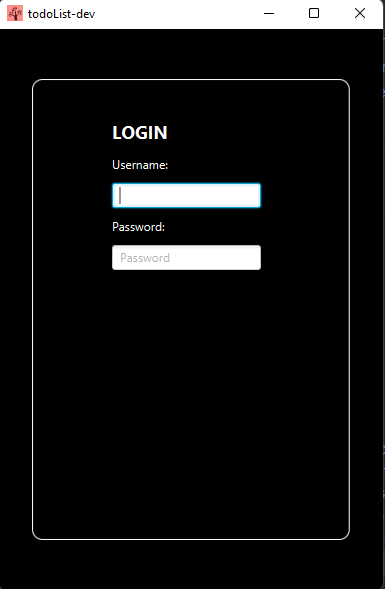 | 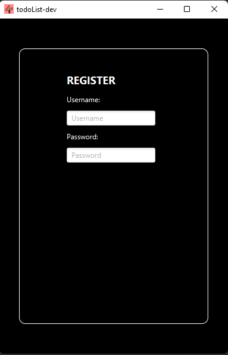 |

### Main Screen (View Mode):

| 4.3 View Mode                               |
|:-------------------------------------------:|
| 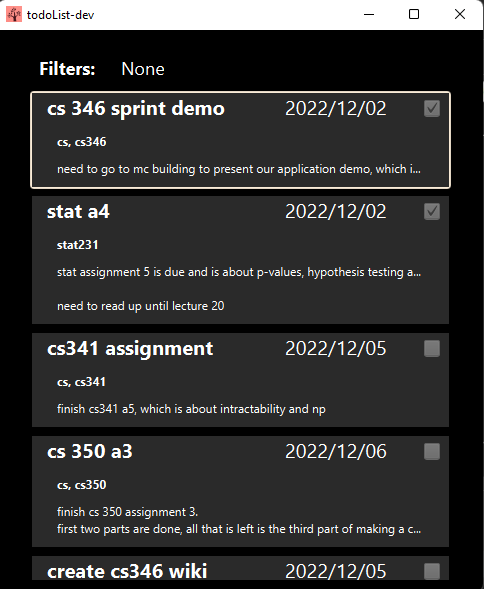 |

### To view, filter by, create and delete tags:

| 4.4 Tag List                          | 4.5 Create Tag                            |
|:-------------------------------------:|:-----------------------------------------:|
| 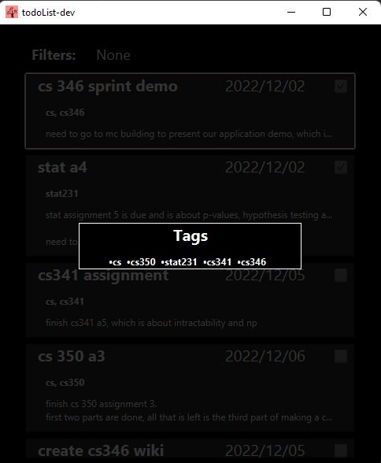 | 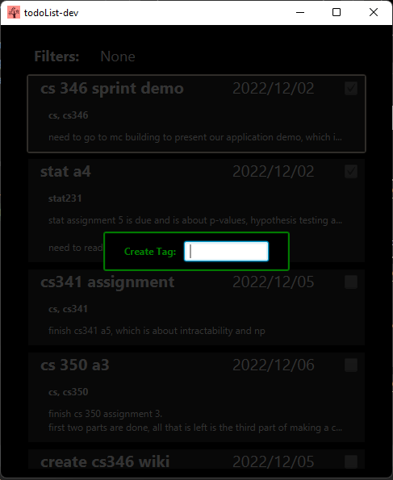 |

| 4.6  Delete Tag                           | 4.7 Filter By Tag                         |
|:-----------------------------------------:|:-----------------------------------------:|
| 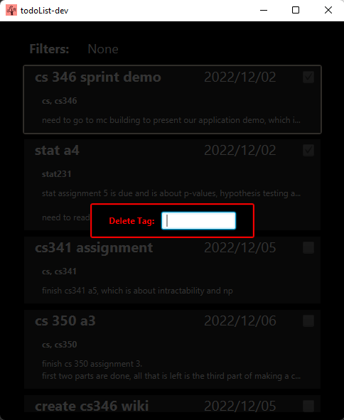 | 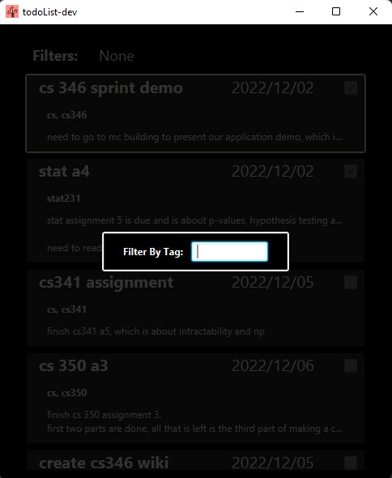 |

### Edit Tasks:

| 4.8 Edit Mode                               |
|:-------------------------------------------:|
| 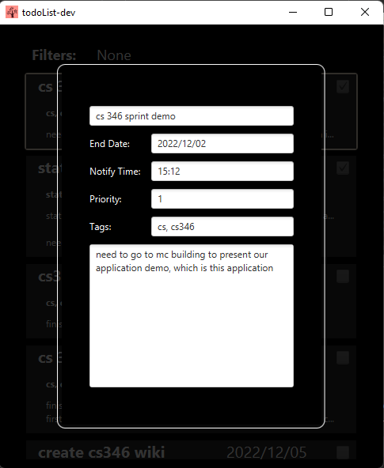 |

### Example of sort and filtered view:

This is an example of creating a filter by the tag CS and sorting lexographically on the name.
There are many other options for filtering, filter by: name, priority or date. In addition you can filter 
by anything (which is really a general search function).

| 4.9 Filtering & Sorting                     |
|:-------------------------------------------:|
| 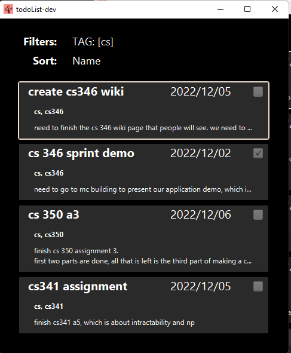  |

### Notifications:
| 4.10 Notifications                          |
|:-------------------------------------------:|
| 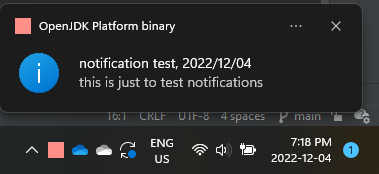  |

## 5. Installation
After downloading the application locally, if you are using IntelliJ access the Gradle tab on the right, then Clean, 
Build and Jpackage the application. Then under demoList > build > jpackage there will be a native installer you can run 
to download the application locally. Note: jpackage takes time to download.

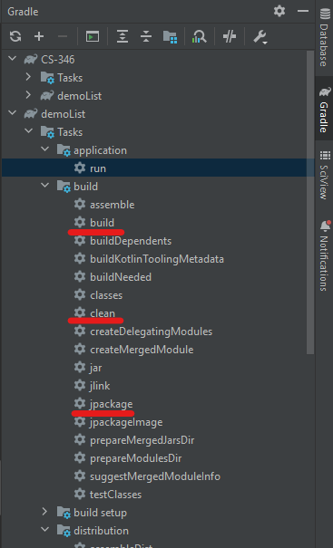

Location of native installer (Windows example):

`C:\{Location of Application}\{Name of Application}\demoList\build\jpackage\ToDoList-1.1.0.msi`

## 6. Acknowledgments of Third Parties
[Gradle](https://github.com/gradle/gradle)

[ktor](https://github.com/ktorio/ktor)

[HTTP networking library for Deserialization](https://github.com/kittinunf/fuel/blob/master/fuel-gson/README.md)

[Google Gson, for serialization](https://javadoc.io/doc/com.google.code.gson/gson/2.9.0/com.google.gson/com/google/gson/Gson.html)

[Using System Tray (AWT) to Control JavaFX Application](https://gist.github.com/jewelsea/e231e89e8d36ef4e5d8a)

## 7. License
[CC BY-NC-ND 3.0](https://creativecommons.org/licenses/by-nc-nd/3.0/legalcode)

